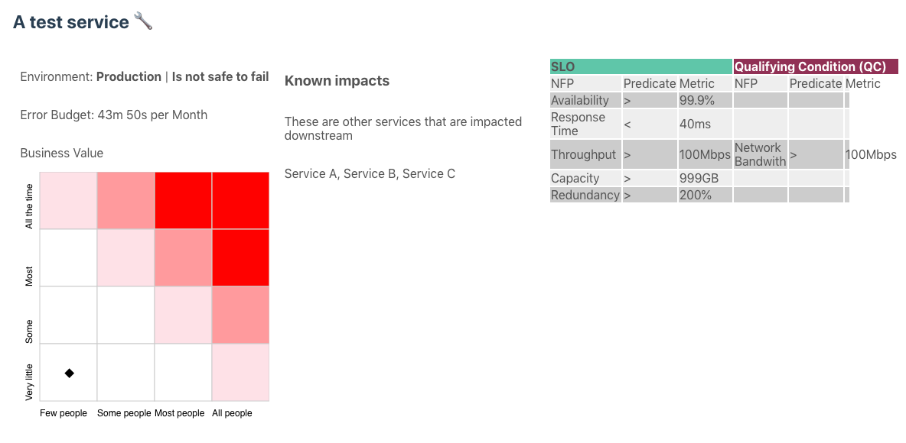

# Spectacle

Spectable is a PoC based on the idea of capturing and displaying SLIs, SLOs, SLAs and bringing them closer to the business value.

**<a href="https://www.theslate.co">If you are looking for a fully hosted version service catalogue to turn your team's tribal knowledge into organisational context, checkout The Slate</a>**

It's based on mashing together ~~two~~ three ideas;
* [Netflix's Monocle dashboard](https://blog.acolyer.org/2019/07/05/automating-chaos-experiments-in-production/), (except it isn't automated to any actual chaos engineering tests),
* The metrics from <a href="https://www.amazon.com/Accelerate-Software-Performing-Technology-Organizations/dp/1942788339">Accelerate: The Science of Lean Software and DevOps: Building and Scaling High Performing Technology Organizations</a>,
* and the product management prioritisation idea of "Red Routes".

Norah Jones mentions in her great talk [Rethinking Chaos Engineering](https://www.infoq.com/presentations/rethinking-chaos-engineering/), the value of the dashboard was in giving teams visablity to their own assumptions, downstream impacts, etc. I thought that was worth exploring by adding in a layer of business value to it (e.g. how many users rely on this service and how often). In an ideal world you could get your Repo + CI/CD pipeline to calculate these results. But hey, ¯\_(ツ)_/¯ PoC.



A friend, Ben, suggested hooking it up to monitoring and alerting systems as a next step. We'll see Ben, we'll see.

## Project setup
```
npm install
```

### Compiles and hot-reloads for development
```
npm run serve
```

### Compiles and minifies for production
```
npm run build
```

### Run your unit tests
```
npm run test:unit
```

### Lints and fixes files
```
npm run lint
```
